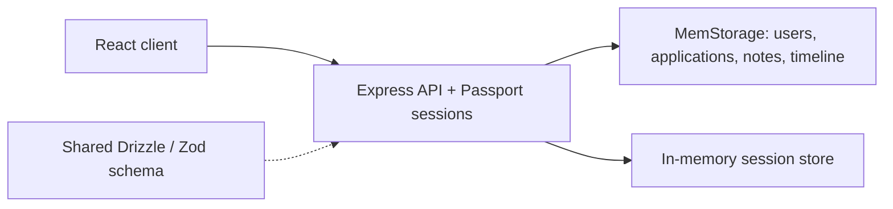

# JobTrackerPro

A full-stack job application tracker built with React, TypeScript, and Express. It brings application records, notes, status changes, and summary statistics into one interface.

**Status:** development prototype. The current server stores application data and sessions in memory. Restarting it clears that data. PostgreSQL schema definitions are present, but the running application does not currently use a PostgreSQL storage adapter.

## Implemented backend capabilities

- Account registration, login, logout, and session-based authentication.
- Create, read, update, and delete job application records.
- Application notes and timeline events.
- Automatic timeline entries for application creation and status changes.
- Per-user application counts grouped by status.

These capabilities are visible in the source; this README does not claim that an end-to-end test suite has verified them.

## Architecture



React and Vite provide the frontend. Express serves the API and the frontend from one origin. Passport Local handles username/password authentication; passwords are hashed using scrypt and a random salt. Shared schema definitions provide TypeScript types and Zod validation for application-related routes.

The storage interface separates route handling from the current in-memory implementation, providing a place to add persistence.

## Local development

Install Node.js and npm, then:

```sh
git clone https://github.com/CyberTekena/JobAppManager.git
cd JobAppManager
npm install
```

Set a random session secret for this shell.

**macOS / Linux:**

```sh
export SESSION_SECRET="$(node -e "process.stdout.write(require('crypto').randomBytes(32).toString('hex'))")"
npm run dev
```

**Windows PowerShell:**

```powershell
$env:SESSION_SECRET = node -e "process.stdout.write(require('crypto').randomBytes(32).toString('hex'))"
npm run dev
```

Open http://127.0.0.1:3000. The server currently binds to this address and hard-codes port 3000. A database is not required for the current in-memory runtime. Use disposable demonstration data.

## Commands

| Command | Purpose |
| --- | --- |
| `npm run dev` | Start Express with Vite in development mode |
| `npm run check` | Run the TypeScript compiler |
| `npm run build` | Build the frontend and bundle the server |
| `npm start` | Run the built server using POSIX-style environment assignment |
| `npm run db:push` | Apply the shared schema to a configured PostgreSQL database |

On PowerShell, run the built server with:

```powershell
$env:NODE_ENV = 'production'
node dist/index.js
```

Building for production does not resolve the prototype limitations listed below.

### Optional database schema tooling

`drizzle.config.ts` requires `DATABASE_URL` for `npm run db:push`. Use a development database and review schema changes before applying them. This command changes the database schema; it does **not** switch the runtime from `MemStorage` to PostgreSQL. The server does not currently load a `.env` file automatically.

## Repository layout

```text
client/src/        React pages, components, and hooks
server/auth.ts     Passport authentication and session configuration
server/routes.ts   Application, note, timeline, and statistics endpoints
server/storage.ts  Storage interface and in-memory implementation
shared/schema.ts   Drizzle tables, Zod schemas, and shared types
drizzle.config.ts  Optional PostgreSQL schema tooling
```

## Security and current limitations

- The note-deletion endpoint checks authentication but does not check ownership. Resolve this before any shared deployment.
- Authentication has a hard-coded fallback session secret. Set `SESSION_SECRET`; a future change should reject missing secrets outside local development.
- Session cookie hardening, registration validation, rate limiting, and CSRF defenses need review before deployment.
- API logging captures response content. Review and redact personal data before using real application records.
- Data and sessions are process-local and are lost on restart. Multiple server instances would not share their state.
- The repository currently has no automated test suite or CI workflow. Type checking is not a substitute for behavioral tests.
- Setup commands and build behavior have not been runtime-verified as part of this documentation update.

## Next engineering milestones

1. Add authorization regression tests and fix note deletion across user boundaries.
2. Validate registration input and enforce secure session configuration.
3. Implement persistent storage and test data isolation and restart behavior.
4. Add repeatable installation, build, and test checks in CI.
5. Add screenshots and a short demonstration after validating the main user flows.
